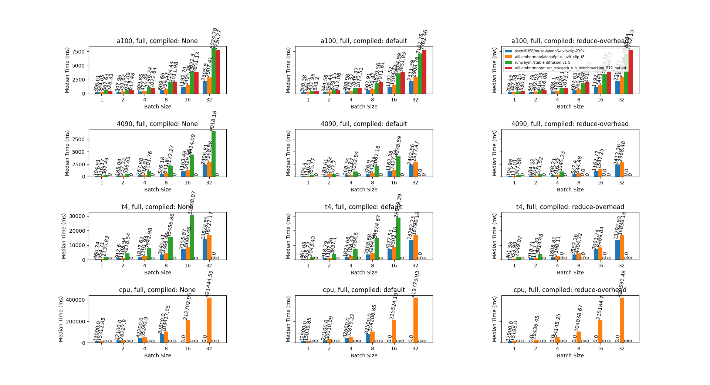
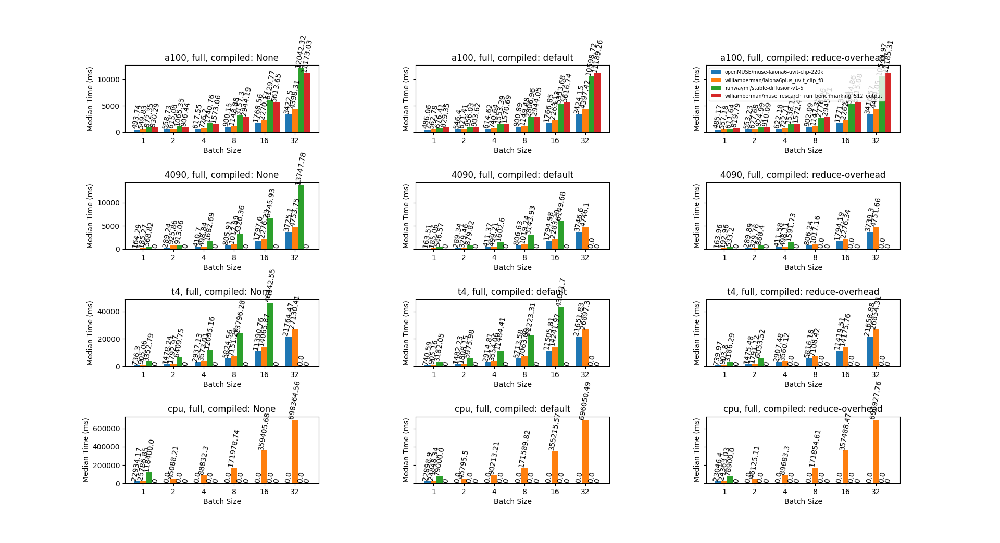
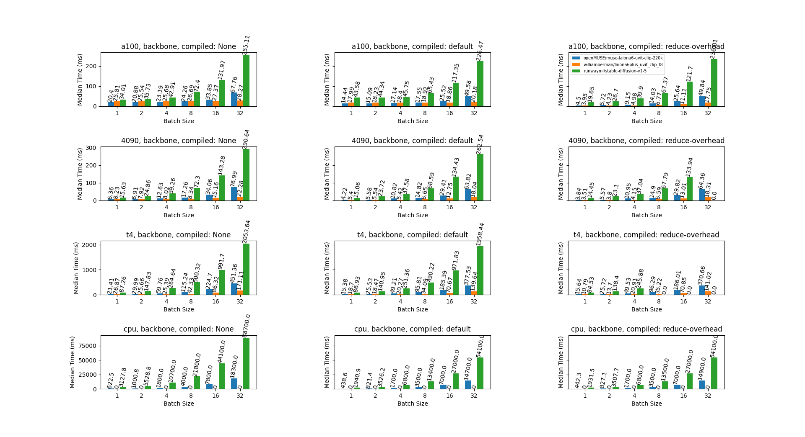
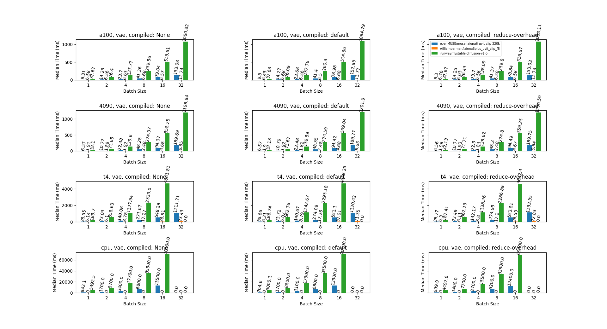
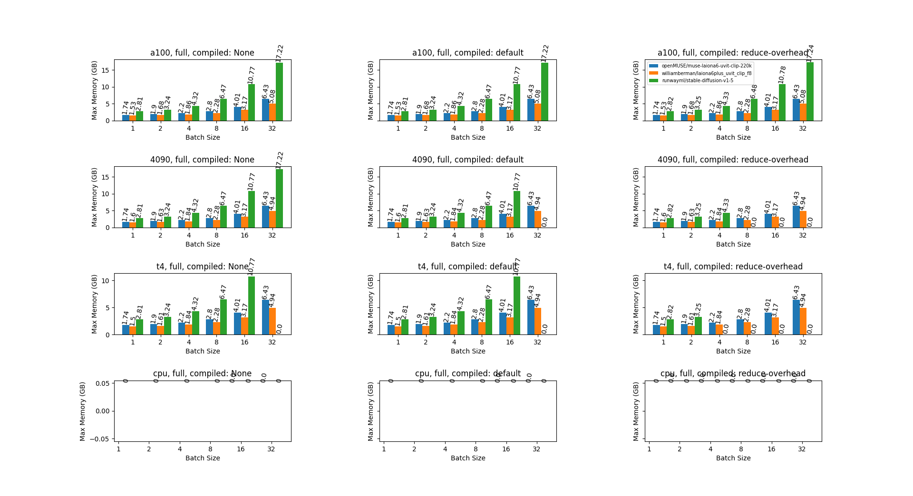
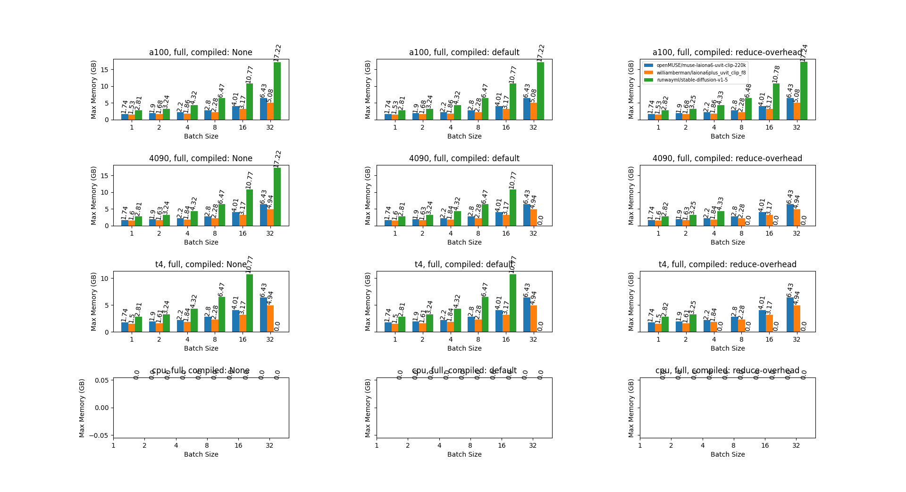
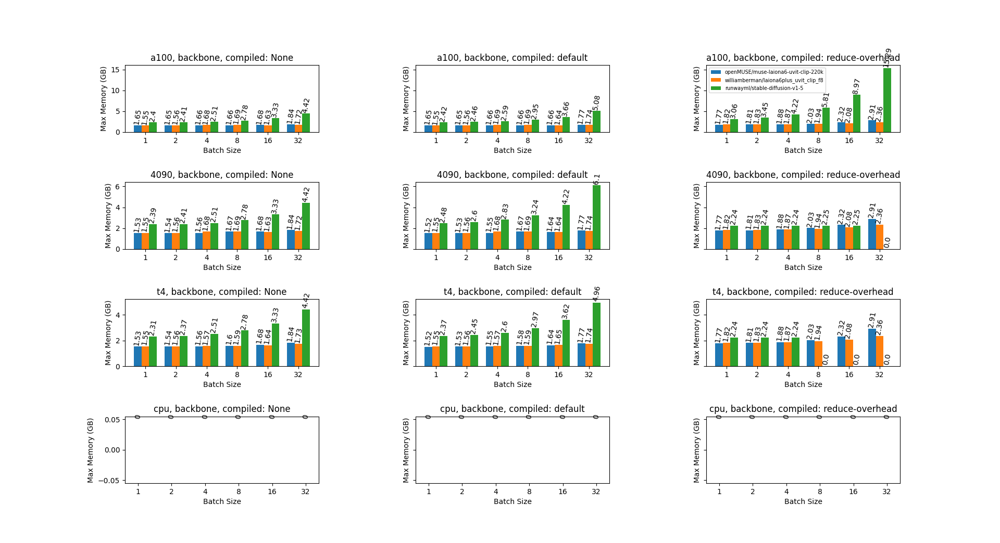
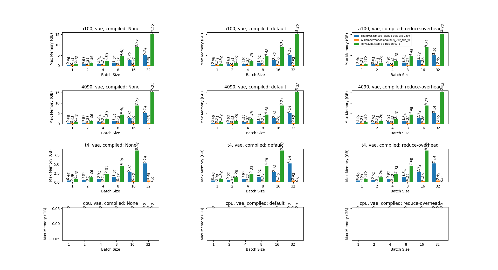

These are a set of script to generate performance benchmarks of the different open muse architectures compared 
to stable diffusion 1.5

### Time

##### Full pipeline 12 steps

##### Full pipeline 20 steps

##### Backbone

##### Vae

### Peak Memory

##### Full pipeline 12 steps

##### Full pipeline 20 steps

##### Backbone

##### Vae

